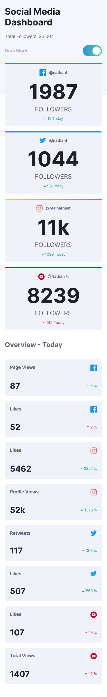
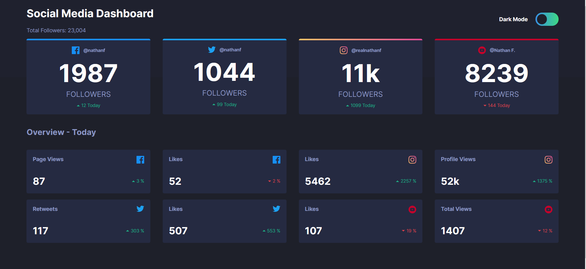
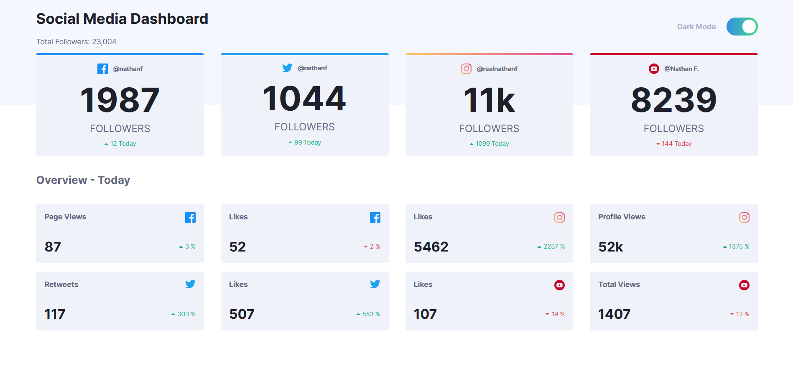

# Frontend Mentor - Social media dashboard with theme switcher solution

This is a solution to the [Social media dashboard with theme switcher challenge on Frontend Mentor](https://www.frontendmentor.io/challenges/social-media-dashboard-with-theme-switcher-6oY8ozp_H). 

## Table of contents

- [Overview](#overview)
  - [The challenge](#the-challenge)
  - [Screenshot](#screenshot)
- [My process](#my-process)
  - [Built with](#built-with)
  - [What I learned](#what-i-learned)
  - [Useful resources](#useful-resources)
- [Author](#author)

## Overview

### The challenge

Users should be able to:

- View the optimal layout for the site depending on their device's screen size
- See hover states for all interactive elements on the page
- Toggle color theme to their preference

### Screenshots
<p align="right">
  
</p>
<p align="left">


</p>


## My process

### Built with

- Semantic HTML5 markup
- CSS custom properties
- SCSS
- Flexbox
- CSS Grid
- [React](https://reactjs.org/) - JS library
- 
### What I learned

In this challenge I learned how to make custom themes. Particularly, how to build a theme provider and switcher and how
to organize the css to accommodate all themes in the stylesheets with the goal in mind to make it as maintainable and expandable as possible
by using css custom variables and a general stylesheet for themes.


```scss

html[data-theme="dark"] {
/* Neutral - Dark Theme */
--bg-color: hsl(230, 17%, 14%);
--bg-color-top: hsl(232, 19%, 15%);
}

html[data-theme="light"] {
/* Neutral - Light Theme */
--bg-color: hsl(0, 0%, 100%);
--bg-color-top: hsl(225, 100%, 98%);
}
```

I also learned more about css grids and all their possibilities and extra features, for example:
- naming lines and areas
- overlapping grid items
- organization of rows and columns with functions and fractions
```scss
.grid {
  display: grid;
  grid-template-columns: [left-border] 1fr [left] 20fr [right] 1fr [right-border];
  grid-template-rows: [header] auto [header] 100px [main] 1fr [footer] 100px [footer];
  grid-template-areas:
      "header-left header header-right"
      "header-left header-bottom header-right"
      "left main right"
      ". footer .";
}

.cards-grid {
  display: grid;
  grid-template-columns: 1fr [left] repeat(2, 1fr [middle]) 1fr [right];
  grid-area: header-bottom-start / left-end / main-end / right-start;
  grid-gap: 1rem 2rem;
  justify-content: space-between;
  grid-auto-flow: row;

  h2 {
    grid-column: 1 / span right;
  }
}
```
At last, I learned how to use a context so that data is available globally.

```typescript jsx
export const ThemeContext = createContext<ContextProps>({
  darkTheme: true,
  toggleTheme: () => {},
});

const { darkTheme, toggleTheme } = useContext(ThemeContext);
```

### Useful resources
These helped me understand css grid functionalities better
- https://css-tricks.com/almanac/properties/g/grid-auto-columns
- https://css-tricks.com/snippets/css/complete-guide-grid

Other interesting articles...
- [CSS variables in media queries](https://bholmes.dev/blog/alternative-to-css-variable-media-queries) - a nice article explaining the use of css custom properties in media queries
- [React Themes](https://jskim1991.medium.com/react-how-to-implement-color-themes-using-scss-f8a774ee0f20) - useful article on how to build a theme switcher in react
- [CSS custom variables](https://codyhouse.co/blog/post/css-custom-properties-vs-sass-variables) - a very interesting article on how to use css variables 

## Author

Annalisa Comin
